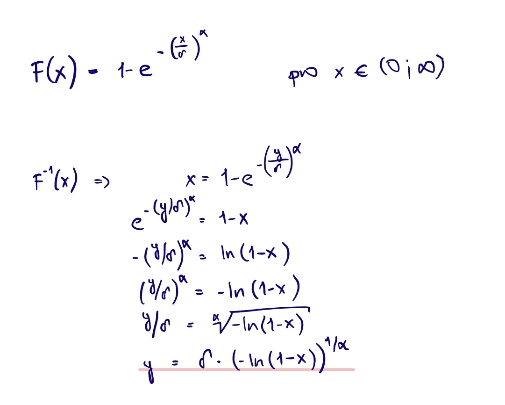

```{r setup, include=FALSE}
knitr::opts_chunk$set(echo = TRUE)
```

## Weibullovo rozdělení

Náhodná veličina $X\sim Wb(\delta,\alpha)$ představuje dobu čekání na nějakou událost, která se neustále může dostavit se šancí úměrnou mocninové funkci pročekané doby.

Hodnota $\delta > 0$ se nazývá parametr měřítka a hodnota $\alpha > 0$ se nazývá parametr formy. 

#### Odvození kvantilové funkce z distribuční funkce

{width=50%}

#### Hustoty, distribuční funkce a kvantilové funkce

1) Rozdělení s hodnotou $\delta=4$ a $\alpha_1=0.5$ 

```{r}
set.seed(5)
delta <- 4
alpha1 <- 0.5
```

Hustota rozdělení

```{r}
curve(dweibull(x, shape = alpha1, scale = delta), 0, 80, xlab = "x", ylab = "PDF", col = "#722F37", lwd = 2)
```

Distribuční funkce

```{r}
curve(pweibull(x, shape = alpha1, scale = delta), 0, 80, xlab = "x", ylab = "CDF", col = "#722F37", lwd = 2)
```

Kvantilová funkce

```{r}
qf1 <- function(x, alpha){
  delta*(log(1-x)^(1/alpha))
}

curve(qf1(x, alpha1), 0, 1, xlab = "x", ylab = "Kvantilova funkce", col = "#722F37", lwd = 2)


curve(qweibull(x, shape = alpha1, scale = delta), 0, 1, xlab = "x", ylab = "Kv. funkce r", col = "#722F37", lwd = 2)

```
<br>Poznámka: Kvantilová funkce podle mého odvození takto vychází pouze, pokud vynechám mínus před logaritmem. Není mi však úplně jasné proč (kvantilovou funkci jsem se snažila kontrolovat i na internetu).

2) Rozdělení s hodnotou $\delta=4$ a $\alpha_2=1$ 

```{r}
alpha2 <- 1
```

Hustota rozdělení

```{r}
curve(dweibull(x, shape = alpha2, scale = delta), 0, 20, xlab = "x", ylab = "PDF", col = "#2E8B57", lwd = 2)
```

Distribuční funkce

```{r}
curve(pweibull(x, shape = alpha2, scale = delta), 0, 20, xlab = "x", ylab = "CDF", col = "#2E8B57", lwd = 2)
```

Kvantilová funkce

```{r}
curve(qweibull(x, shape = alpha2, scale = delta), 0, 1, xlab = "x", ylab = "Kvantilova funkce", col = "#2E8B57", lwd = 2)
```

2) Rozdělení s hodnotou $\delta=4$ a $\alpha_3=3$ 

```{r}
alpha3 <- 3
```

Hustota rozdělení

```{r}
curve(dweibull(x, shape = alpha3, scale = delta), 0, 8, xlab = "x", ylab = "PDF", col = "#00308F", lwd = 2)
```

Distribuční funkce

```{r}
curve(pweibull(x, shape = alpha3, scale = delta), 0, 8, xlab = "x", ylab = "CDF", col = "#00308F", lwd = 2)
```

Kvantilová funkce

```{r}
curve(qweibull(x, shape = alpha3, scale = delta), 0, 1, xlab = "x", ylab = "Kvantilova funkce", col = "#00308F", lwd = 2)
```

## Číselné charekteristiky

```{r}
stredniHodnota <- delta*gamma(1+1/alpha3)
rozptyl <- delta^2*(gamma(1+2/alpha3)-(gamma(1+1/alpha3))^2)
smOdchylka <- sqrt(rozptyl)
prvniDecil <- qweibull(0.10, shape = alpha3, scale = delta)
devatyDecil <- qweibull(0.90, shape = alpha3, scale = delta)
kvRozpeti <- qweibull(0.75, shape = alpha3, scale = delta) - qweibull(0.25, shape = alpha3, scale = delta)
tercilRozpeti <- qweibull(2/3, shape = alpha3, scale = delta) - qweibull(1/3, shape = alpha3, scale = delta)
decRozpeti <- qweibull(0.90, shape = alpha3, scale = delta) - qweibull(0.10, shape = alpha3, scale = delta)
kvOdchylka <-  0.5*kvRozpeti
tercilOchylka <- tercilRozpeti
decOdchylka <- 1/8*decRozpeti
modalniHodnota <- delta*((alpha3-1)/alpha3)^(1/alpha3)
hustVMod <- dweibull(modalniHodnota, shape = alpha3, scale = delta)
distVMod <-  pweibull(modalniHodnota, shape = alpha3, scale = delta)

chPolohy <- setNames(c(stredniHodnota, prvniDecil, devatyDecil, modalniHodnota), c("Střední hodnota", "První decil", "Devátý decil", "Modální hodnota"))
chVariability <- setNames(c(rozptyl, smOdchylka, kvRozpeti, kvOdchylka, tercilRozpeti, tercilOchylka, decRozpeti, decOdchylka), c("Rozptyl", "Směrodatná odchylka", "Kvartilové rozpětí", "Kvartilová odchylka", "Tercilové rozpětí", "Tercilová odchylka", "Decilové rozpětí", "Decolová odchylka"))
chModusu <- setNames(c(hustVMod, distVMod), c("Hodnota hustoty v modální hodnotě", "Hodnota distribuční funkce v modální hodnotě")) 
```

```{r}
chPolohy
```

```{r}
chVariability
```

```{r}
chModusu
```

#### Popis rozdělení

```{r}
curve(pweibull(x, shape = alpha3, scale = delta), 0, 7, xlab = "x", ylab = "CDF a kvantilová funkce", col = "#00308F", lwd = 2, ylim = c(0, 7), xlim = c(0,7), asp = 1)

curve(qweibull(x, shape = alpha3, scale = delta), 0, 1, xlab = "x", ylab = "Kvantilova funkce", col = "#00308F", lwd = 2, add = T)

abline(v=0, col="red", lty=1, lwd=1)
abline(h=0, col="red", lty=1, lwd=1)

```


